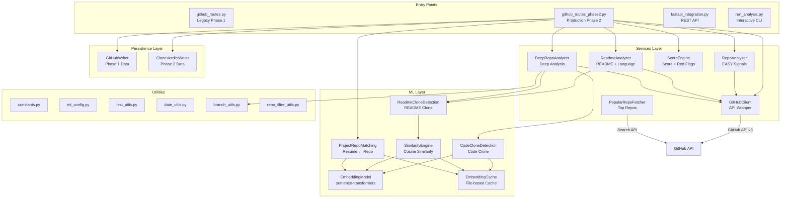

# GitHub Scraper — Complete Architecture Guide

> A two-phase GitHub profile ownership verification system that analyzes repositories to produce a **0–100 ownership score** with red flags, deep clone detection (README + code-level), and resume-to-repo matching.

---

## Table of Contents

1. [High-Level Architecture](#high-level-architecture)
2. [Directory Structure](#directory-structure)
3. [Data Flow](#data-flow)
4. [Package Breakdown](#package-breakdown)
   - [Routes (Entry Points)](#1-routes--entry-points)
   - [Services (Core Logic)](#2-services--core-logic)
   - [ML (Machine Learning)](#3-ml--machine-learning)
   - [Persistence (Data Storage)](#4-persistence--data-storage)
   - [Utils (Shared Utilities)](#5-utils--shared-utilities)
5. [Root-Level Files](#root-level-files)
6. [Configuration & Constants](#configuration--constants)
7. [Scoring System](#scoring-system)
8. [Phase 1 vs Phase 2](#phase-1-vs-phase-2)
9. [External Dependencies](#external-dependencies)
10. [Dry-Run Walkthrough](#dry-run-walkthrough)
11. [Current Limitations & Honest Assessment](#current-limitations--honest-assessment)

---

## High-Level Architecture



---

## Directory Structure

```
ResumeAI/
│
├── github/                          # Main package (all production code)
│   ├── __init__.py                  # Package init
│   │
│   ├── routes/                      # API entry points / orchestrators
│   │   ├── __init__.py
│   │   ├── github_routes.py         # ⚠️ DEPRECATED — Legacy Phase 1 routes
│   │   └── github_routes_phase2.py  # ✅ Production — Phase 1 + Phase 2 routes
│   │
│   ├── services/                    # Core business logic
│   │   ├── __init__.py
│   │   ├── github_client.py         # GitHub API v3 wrapper (314 lines)
│   │   ├── repo_analyzer.py         # Repository signal extraction (199 lines)
│   │   ├── readme_analyzer.py       # README parsing & language matching (165 lines)
│   │   ├── score_engine.py          # Score computation & red flags (223 lines)
│   │   ├── deep_repo_analyzer.py    # Phase 2 deep analysis orchestrator (233 lines)
│   │   └── popular_repo_fetcher.py  # Fetches top GitHub repos for clone comparison (145 lines)
│   │
│   ├── ml/                          # Machine learning components (Phase 2)
│   │   ├── __init__.py
│   │   ├── config/
│   │   │   ├── __init__.py
│   │   │   └── ml_config.py         # All ML thresholds, feature flags, paths (177 lines)
│   │   ├── embeddings/
│   │   │   ├── __init__.py
│   │   │   ├── embedding_model.py   # sentence-transformers wrapper (114 lines)
│   │   │   └── embedding_cache.py   # File-based embedding cache (144 lines)
│   │   ├── inference/
│   │   │   ├── __init__.py
│   │   │   └── similarity_engine.py # Cosine similarity + verdict logic (136 lines)
│   │   └── pipelines/
│   │       ├── __init__.py
│   │       ├── project_repo_matching.py   # Resume project ↔ repo matching (193 lines)
│   │       ├── readme_clone_detection.py  # README clone/template detection (152 lines)
│   │       └── code_clone_detection.py    # ✅ Code-level clone detection (412 lines)
│   │
│   ├── persistence/                 # Database writers
│   │   ├── __init__.py
│   │   ├── github_writer.py         # Phase 1 data persistence (159 lines)
│   │   └── clone_verdict_writer.py  # Phase 2 deep analysis persistence (134 lines)
│   │
│   └── utils/                       # Shared utilities
│       ├── __init__.py
│       ├── constants.py             # Phase 1 weights, thresholds, flags (145 lines)
│       ├── text_utils.py            # Text cleaning & keyword extraction (101 lines)
│       ├── date_utils.py            # Commit date analysis (133 lines)
│       ├── branch_utils.py          # Branch strategy analysis (112 lines)
│       └── repo_filter_utils.py     # Quality filtering for repos (152 lines)
│
├── run_analysis.py                  # ✅ Interactive CLI runner
├── fastapi_integration.py           # Complete FastAPI REST API server
├── example_usage.py                 # Usage examples & demos (Phase 1 only)
├── test_phase2_deterministic.py     # Phase 2 unit tests (6 tests)
├── test_code_clone_detection.py     # ✅ Code clone detection tests (9 tests)
├── test_project_matching.py         # Project matching integration test
├── test_system.py                   # Full system integration tests
├── check_rate_limit.py              # Quick rate limit checker
├── verify_changes.py                # Post-change verification script
├── verify_simple.py                 # Simple import verification
├── debug_imports.py                 # Import debugging helper
├── requirements.txt                 # Phase 1 dependencies (requests only)
├── requirements-phase2.txt          # Phase 2 ML dependencies
├── .env                             # Environment variables (GITHUB_TOKEN)
└── GITHUB_SCRAPER_ARCHITECTURE.md   # This file
```

---

## Data Flow

### Phase 1: Basic Analysis

```
User Input (username or GitHub URL)
    │
    ▼
GitHubClient.get_user_repos()          → Fetch all repos via API (paginated, type=owner)
    │
    ▼
RepoAnalyzer.analyze_repos()           → For each repo:
    ├── Fetch commits (branch-aware)      • Commit count, spread, dump detection
    ├── Check fork/original status        • Template & parent detection
    ├── Check OSS contribution            • Allowlist matching (36 orgs)
    ├── Check trivial name                • Pattern matching (12 patterns)
    └── Get languages                     • API language breakdown
    │
    ▼
ReadmeAnalyzer.analyze_readmes()       → For each repo:
    ├── Fetch README content              • Base64 decode
    ├── Clean & extract keywords          • Regex-based NLP
    └── Check language mismatch           • README keywords vs repo languages
    │
    ▼
ScoreEngine.compute_score()            → Weighted scoring:
    ├── original_ratio (30 pts max)
    ├── commit_depth (25 pts max)
    ├── readme_presence (15 pts max)
    ├── language_match (15 pts max)
    ├── oss_bonus (10 pts max)
    ├── Red flag identification (8 checks)
    └── Penalty calculation (5 pts each, capped at 25)
    │
    ▼
GitHubWriter.write_github_data()       → Persist to DB (if configured)
    │
    ▼
Return: { score, redFlags, components, stats }
```

### Phase 2: Deep Analysis (extends Phase 1)

Phase 2 ONLY triggers when **all** of these conditions are true:
- `resume_projects` is provided (list of project dicts)
- ML dependencies are installed (`sentence-transformers`, etc.)
- Feature flags are enabled (`ENABLE_PROJECT_MATCHING`, etc.)

```
Phase 1 Results + Resume Projects
    │
    ▼
ProjectRepoMatching.match_projects_to_repos()
    ├── Generate embeddings for each resume project (name + desc + techs)
    ├── Generate embeddings for each repository (name + desc + languages)
    ├── Cosine similarity matching (best repo per project)
    └── Return matched project ↔ repo pairs with similarity + match_strength
    │
    ▼
apply_quality_filters() + get_top_repos()                        ⚠️ CRITICAL GATE
    ├── filter_original_only()     → Remove forks
    ├── filter_with_readme()       → Must have a README
    ├── filter_non_trivial()       → Must not be a trivial repo
    ├── filter_by_commit_count()   → MINIMUM 5 COMMITS REQUIRED
    └── get_top_repos()            → Sort by commits, limit to MAX_DEEP_ANALYSIS_REPOS (10)
    │
    ▼ (if any repos survive the filters — often NONE do)
DeepRepoAnalyzer.deep_analyze_matched_repos()
    ├── For each surviving matched repo:
    │   ├── Fetch branches & per-branch commits
    │   ├── Analyze commit spread & branch strategy
    │   ├── Fetch similar popular repos (GitHub Search API)
    │   ├── ReadmeCloneDetection: compare README vs popular repos
    │   │   ├── Compute cosine similarity scores
    │   │   ├── Verdict: COPIED (≥0.90) / TEMPLATE (≥0.80) / ORIGINAL (<0.80)
    │   │   └── Generate red flags & penalty (25 / 15 / 0)
    │   └── CodeCloneDetection: compare source code vs popular repos
    │       ├── Extract code files via git/trees API endpoint
    │       ├── Normalize code (regex: remove comments, licenses, whitespace)
    │       ├── Chunk code → embed each chunk → mean-pool to single vector
    │       ├── Structural pre-filter (Jaccard on file paths, threshold 0.30)
    │       ├── Cosine similarity on embeddings
    │       ├── Verdict: COPIED (≥0.88) / TEMPLATE (≥0.72) / ORIGINAL (<0.72)
    │       └── Penalty (20 / 7 / 0) — folded into clone_penalty
    │
    ▼
Final Score = Phase1 Score - sum(clone_penalties)
    │
    ▼
CloneVerdictWriter.write_deep_analysis()  → Persist Phase 2 data (if DB configured)
```

---

## Package Breakdown

### 1. Routes — Entry Points

#### `github_routes_phase2.py` ✅ (Production)
**326 lines** | The main orchestrator for the entire analysis pipeline.

**Class: `GitHubAnalysisService`**

| Method | Purpose |
|--------|---------|
| `__init__(github_token, db_client)` | Initializes all Phase 1 & Phase 2 components. Gets token from `GITHUB_TOKEN` env var if not provided. Phase 2 components are optional — wrapped in try/except for graceful degradation. |
| `extract_username_from_url(github_url)` | Static method. Extracts username from URLs like `https://github.com/user` or returns raw username. Filters out known GitHub paths (`/explore`, `/trending`, etc.). |
| `analyze_github_profile(github_input, user_id, resume_projects)` | Main pipeline entry point. Runs Phase 1 always, Phase 2 conditionally (only if `resume_projects` provided and ML dependencies installed). Applies quality pre-filtering before deep analysis. |
| `get_rate_limit_status()` | Proxies to `GitHubClient.check_rate_limit()`. |
| `is_phase2_enabled()` | Returns whether Phase 2 ML dependencies are available. |

**Key design decisions:**
- Phase 2 imports are wrapped in `try/except ImportError` so the system works without ML dependencies
- Pre-filters repos through `apply_quality_filters()` and `get_top_repos()` before deep analysis
- Clone penalties subtract from the Phase 1 score, floor-clamped at 0

**Critical behavior (learned from dry run):**
- Phase 2 deep analysis **only runs** if `resume_projects` is provided
- The quality filter (`apply_quality_filters`) requires minimum **5 commits** — this is a strict gate that frequently filters out all matched repos, resulting in `deep_analysis: []`
- When `deep_analysis` is empty, clone detection (both README and code) **never executes**

---

#### `github_routes.py` ⚠️ (Deprecated Legacy)
**316 lines** | Original Phase 1 route file.

Identical class name (`GitHubAnalysisService`) but lacks pre-filtering and has a known bug where `clone_penalty` is passed incorrectly. Kept only for backward compatibility with auxiliary scripts (`example_usage.py`, `fastapi_integration.py`).

---

### 2. Services — Core Logic

#### `github_client.py`
**314 lines** | Raw GitHub API v3 wrapper.

**Class: `GitHubClient`**

| Method | Purpose |
|--------|---------|
| `__init__(token)` | Sets up `requests.Session` with auth headers. Token is optional (unauthenticated = 60 req/hr, authenticated = 5,000 req/hr). |
| `get_user_repos(username)` | Fetches all repos with pagination (100/page). Only `type=owner` repos. |
| `get_repo_languages(owner, repo_name)` | Returns `{language: bytes}` mapping from GitHub Language API. |
| `get_repo_readme(owner, repo_name)` | Fetches and base64-decodes README content. Returns `None` if no README. |
| `get_repo_commits(owner, repo, username, max_commits, all_branches)` | Multi-branch commit fetching. When `all_branches=True`, fetches from all branches (up to `MAX_BRANCHES_TO_ANALYZE`), deduplicates by SHA, and sorts by date. |
| `get_repo_branches(owner, repo_name)` | Fetches branch list for a repo. |
| `_fetch_commits_single_branch(owner, repo, username, max_commits, sha)` | Internal helper — fetches commits for one branch. `sha` param specifies the branch. |
| `get_repo_tree(owner, repo_name)` | **NEW** — Fetches the full recursive file tree. Auto-detects default branch from repo metadata (not hardcoded to "main"). Returns list of `{path, type, size}` entries. |
| `get_file_content(owner, repo_name, path)` | **NEW** — Fetches a single file's content via the `/contents/` endpoint. Checks `type == "file"` before base64-decoding to avoid errors when the API returns a directory listing. |
| `check_rate_limit()` | Returns current rate limit status. |

**Important notes:**
- All methods return empty collections (`[]`, `{}`, `None`) on API errors — no exceptions propagated
- There is a duplicate `get_repo_commits` method at lines 125-149 (dead code, shadowed by the newer version at line 163)
- Uses `requests.Session` for connection pooling

---

#### `repo_analyzer.py`
**199 lines** | Extracts "EASY" ownership signals from repositories.

**Class: `RepoAnalyzer`**

| Method | Purpose |
|--------|---------|
| `analyze_repos(username, repos)` | Main entry. Loops through every repo, aggregates stats. Returns `repositoryStats`, `commitStats`, `commitSpread`, `ossContributions`, `trivialRepos`, `reposDumpPattern`, and `enrichedRepositories`. |
| `_analyze_single_repo(username, repo)` | Per-repo analysis: commits, fork detection, template detection, parent/source detection, OSS contribution check, trivial name check, language retrieval. |
| `_is_oss_contribution(repo, commit_count)` | Checks if a forked repo is from a known OSS organization (from `OSS_ALLOWLIST`) with ≥ `MIN_OSS_COMMITS`. |

**Enriched repo fields added:** `is_fork`, `is_template`, `has_parent`, `parent_repo`, `is_original`, `is_oss_contribution`, `commit_count`, `commit_dates`, `has_dump_pattern`, `is_trivial`, `languages`, `stars`, `forks`, `created_at`, `updated_at`, `description`.

---

#### `readme_analyzer.py`
**165 lines** | Parses READMEs and checks language consistency.

**Class: `ReadmeAnalyzer`**

| Method | Purpose |
|--------|---------|
| `analyze_readmes(enriched_repos)` | Iterates repos, fetches README, extracts keywords, checks language mismatch. Returns `readmeStats`, `languageMatchStats`, and `enhancedRepositories` (repos enriched with README data). |
| `_analyze_single_readme(repo_data)` | For one repo: fetches README via API, cleans text, extracts language keywords, checks mismatch. Adds `has_readme`, `readme_length`, `readme_detected_languages`, `has_language_mismatch`. |
| `_check_language_mismatch(detected_languages, repo_languages)` | Compares languages found in README text vs top 3 repo languages from GitHub API. Mismatch = README mentions languages that aren't in the repo. |
| `get_dominant_languages(repo_languages, top_n)` | Helper to get top N languages by byte count. |

**Mismatch logic:** A global mismatch flag is only raised when `≥ MISMATCH_REPO_THRESHOLD` (2) repos have individual mismatches.

---

#### `score_engine.py`
**223 lines** | Computes the final 0–100 ownership score.

**Class: `ScoreEngine`**

| Method | Weight | Logic |
|--------|--------|-------|
| `_score_original_ratio(ratio)` | 30 pts | Linear: `ratio × 30`. E.g., 67% original → 20 pts |
| `_score_commit_depth(commit_stats)` | 25 pts | Tiered: 50+ avg → 100%, 20+ → 92%, 10+ → 72%, 5+ → 40%, <5 → 20% |
| `_score_readme_presence(readme_stats)` | 15 pts | Linear: `presence_ratio × 15`. E.g., 100% → 15 pts |
| `_score_language_match(language_match_stats)` | 15 pts | Binary: mismatch → 30%, no mismatch → 100% |
| `_score_oss_contributions(oss_count)` | 10 pts | Tiered: 3+ → 100%, 1-2 → 50%, 0 → 0% |

**Maximum raw score: 95 pts** (not 100 — the components sum to 95).

**8 Red flag checks:**

| # | Flag | Condition | Penalty |
|---|------|-----------|---------|
| 1 | Mostly forked | `original_ratio < 0.4` | 5 pts |
| 2 | Low commit depth | `avg_per_repo < MIN_COMMITS_PER_REPO` (5) | 5 pts |
| 3 | Commit dump | Overall dump pattern OR ≥2 repos with dump | 5 pts |
| 4 | Missing README | `readme_presence_ratio < 0.5` | 5 pts |
| 5 | Tech stack mismatch | Global language mismatch flag | 5 pts |
| 6 | Trivial repos | `> 40%` of repos are trivial | 5 pts |
| 7 | Template repos | `> 50%` of repos are templates | 5 pts |
| 8 | Parent/source | Any repo has a parent/source repo (disguised fork) | 5 pts |

**Penalty:** 5 points per flag, capped at `RED_FLAG_PENALTY_MAX` (25).

**Formula:** `final_score = clamp(raw_score - red_flag_penalty - clone_penalty, 0, 100)`

---

#### `deep_repo_analyzer.py`
**233 lines** | Phase 2 — In-depth repository analysis.

**Class: `DeepRepoAnalyzer`**

| Method | Purpose |
|--------|---------|
| `__init__(github_client)` | Initializes with GitHub client, creates `ReadmeCloneDetection`, **`CodeCloneDetection`**, and `PopularRepoFetcher` instances. |
| `analyze_repo_deep(owner, repo_name, username, readme)` | Deep-analyzes one repo. Runs 3 steps in sequence: (1) branch-aware commit analysis, (2) README clone detection, (3) **code clone detection**. |
| `analyze_repos_deep(repos, username)` | Batch wrapper — calls `analyze_repo_deep` for each repo, collects results. |
| `deep_analyze_matched_repos(matched_repos, all_repo_data)` | Called by route files. Extracts repo info from matched projects, runs deep analysis, enriches results with `clone_penalty` (README penalty + code clone penalty combined) and `deep_red_flags`. |

**Deep analysis result fields per repo:** `repo_name`, `owner`, `commit_stats` (total commits, branch count, is_dump_pattern, spread analysis), `branch_strategy`, `clone_detection` (README similarity, verdict, matched repo), **`code_clone_detection`** (code similarity, verdict, matched repo, penalty, red flags), `red_flags`, `clone_penalty` (sum of README + code penalties), `deep_red_flags`.

**Penalty folding logic in `deep_analyze_matched_repos()`:**
```python
# Line 228: README clone penalty from SimilarityEngine
result["clone_penalty"] = engine.get_penalty(similarity)
# Line 230: Code clone penalty added on top
result["clone_penalty"] += result.get("code_clone_detection", {}).get("penalty", 0)
```

This means `clone_penalty` for a single repo can be up to **45 pts** (25 from README COPIED + 20 from code COPIED).

---

#### `popular_repo_fetcher.py`
**145 lines** | Fetches top GitHub repos for clone comparison.

**Class: `PopularRepoFetcher`**

| Method | Purpose |
|--------|---------|
| `__init__(github_token)` | Sets up session and in-memory cache with TTL. |
| `fetch_top_repos(language, min_stars)` | Generic search for top repos by language/stars using GitHub Search API. Caches results. |
| `fetch_similar_repos(repo_name, readme_keywords)` | Builds a search query from repo name + README keywords, fetches matching repos. Used by both clone detection pipelines to find potential originals. |
| `_get_cache_key(*args)` | SHA256-based cache key generation. |

**Cache:** In-memory dict with TTL (from `ml_config.POPULAR_REPO_CACHE_TTL`). Cross-platform cache dir using `tempfile.gettempdir()`.

---

### 3. ML — Machine Learning

#### `ml_config.py`
**177 lines** | Central configuration for all ML settings.

| Category | Key Constants |
|----------|---------------|
| **Model** | `EMBEDDING_MODEL_NAME = "all-MiniLM-L6-v2"`, `EMBEDDING_DIM = 384`, `MAX_SEQUENCE_LENGTH = 512` |
| **README similarity thresholds** | `SIMILARITY_VERY_HIGH = 0.90` (COPIED), `SIMILARITY_HIGH = 0.80` (TEMPLATE), below = ORIGINAL |
| **README penalties** | `PENALTY_VERY_HIGH_SIMILARITY = 25`, `PENALTY_HIGH_SIMILARITY = 15` |
| **Code similarity thresholds** | `CODE_SIMILARITY_HIGH = 0.88` (COPIED), `CODE_SIMILARITY_MEDIUM = 0.72` (TEMPLATE), below = ORIGINAL |
| **Code penalties** | `CODE_CLONE_PENALTY_HIGH = 20`, `CODE_CLONE_PENALTY_MEDIUM = 7` |
| **Code extraction limits** | `MAX_CODE_FILES_PER_REPO = 50`, `MAX_CODE_FILE_SIZE = 200000` (200KB), `CODE_CHUNK_CHAR_LENGTH = 1500` |
| **Code pre-filter** | `MAX_REFERENCE_REPOS = 3`, `STRUCTURE_SIMILARITY_THRESHOLD = 0.30` (Jaccard) |
| **Code file types** | `SUPPORTED_CODE_EXTENSIONS = (".py", ".js", ".ts", ".java", ".cpp", ".c", ".go", ".cs", ".php", ".rb")` |
| **Code exclusions** | `EXCLUDED_CODE_DIRS = ("node_modules", "dist", "build", "vendor", ".min.js", "__pycache__", ".git", "venv", "env")` |
| **Processing limits** | `MAX_DEEP_ANALYSIS_REPOS = 10`, `TOP_REPOS_COUNT = 10` |
| **Verdicts** | `CLONE_VERDICT_COPIED`, `CLONE_VERDICT_TEMPLATE`, `CLONE_VERDICT_ORIGINAL` |
| **Caching** | `ENABLE_EMBEDDING_CACHE = True`, `EMBEDDING_CACHE_TTL_HOURS = 72`, `EMBEDDING_CACHE_DIR` uses `tempfile.gettempdir()` |
| **Feature flags** | `ENABLE_README_CLONE_DETECTION`, `ENABLE_BRANCH_AWARE_COMMITS`, `ENABLE_CODE_CLONE_DETECTION`, `ENABLE_PROJECT_MATCHING`, `DEEP_ANALYZE_MATCHED_REPOS_ONLY` |
| **Project matching** | `PROJECT_MATCH_THRESHOLD_HIGH = 0.75`, `PROJECT_MATCH_THRESHOLD_MEDIUM = 0.60`, `PROJECT_MATCH_THRESHOLD_LOW = 0.50` |
| **Inference** | `DEVICE = "cpu"`, `NUM_THREADS = 4`, `EMBEDDING_BATCH_SIZE = 8` |

---

#### `embedding_model.py`
**114 lines** | Wrapper around `sentence-transformers`.

**Class: `EmbeddingModel`**

| Method | Purpose |
|--------|---------|
| `__init__()` | Sets model name and dimension. Model is **not** loaded yet (lazy loading). |
| `_load_model()` | Loads `SentenceTransformer` on first use. Forces CPU-only (`device="cpu"`). |
| `get_embedding(text)` | Returns normalized 384-dim numpy vector for one text. Truncates to `MAX_TEXT_LENGTH` chars. |
| `get_embeddings_batch(texts)` | Batch embedding generation (more efficient). |
| `encode(text, normalize)` | Direct encode method used by `CodeCloneDetection` pipeline. |
| `compute_similarity(text1, text2)` | Convenience: embed both texts, return cosine similarity. |

**Key design:** Lazy loading avoids model load overhead if never called. CPU-only ensures portability. First call downloads the model (~90MB) and takes 10-30 seconds.

---

#### `embedding_cache.py`
**144 lines** | File-based embedding cache.

**Class: `EmbeddingCache`**

| Method | Purpose |
|--------|---------|
| `__init__(cache_dir)` | Creates cache directory. Defaults to `tempfile.gettempdir()/github_embeddings_cache`. |
| `get(text)` | Returns cached numpy array or `None`. Uses SHA256 hash of text as filename. Checks TTL expiration. |
| `set(text, embedding)` | Saves embedding as `.npy` file + metadata `.json` (timestamp, text length). Silent failure on write errors. |
| `_get_cache_key(text)` | SHA256 hash of text → hex string. |

**Cache format:** Each entry = two files: `{sha256_hash}.npy` (embedding) + `{sha256_hash}.json` (metadata).

---

#### `similarity_engine.py`
**136 lines** | Computes and interprets similarity scores.

**Class: `SimilarityEngine`**

| Method | Purpose |
|--------|---------|
| `__init__()` | Creates `EmbeddingModel` and `EmbeddingCache`. |
| `compute_similarity(text1, text2)` | Returns float 0.0–1.0 cosine similarity. Uses cache for both texts. |
| `find_max_similarity(candidate, references)` | Compares candidate against list of references, returns highest similarity + matched reference. |
| `get_verdict(similarity)` | Maps score → `COPIED` (≥0.90) / `TEMPLATE` (≥0.80) / `ORIGINAL` (<0.80). |
| `get_penalty(similarity)` | Maps score → penalty points: COPIED = 25, TEMPLATE = 15, ORIGINAL = 0. |
| `get_red_flags(similarity)` | Generates red flag messages based on verdict. |

---

#### `project_repo_matching.py`
**193 lines** | Matches resume projects to GitHub repositories.

**Class: `ProjectRepoMatching`**

| Method | Purpose |
|--------|---------|
| `__init__()` | Initializes `EmbeddingModel` + `EmbeddingCache` (if enabled via `USE_EMBEDDING_CACHE`). |
| `match_projects_to_repos(projects, repositories)` | Main entry. For each resume project, finds best matching repository by embedding similarity. Returns list of `{project, repository, similarity, match_strength}`. |
| `_create_project_text(project)` | Combines project name + description + technologies into embeddable text. |
| `_create_repo_text(repo)` | Combines repo name + description + languages into embeddable text. |
| `_determine_match_strength(similarity)` | Maps similarity → `HIGH` (≥0.75) / `MEDIUM` (≥0.60) / `LOW` (<0.60). |

**Thresholds:** Imported from `ml_config.py` (`PROJECT_MATCH_THRESHOLD_HIGH`, `PROJECT_MATCH_THRESHOLD_MEDIUM`).

---

#### `readme_clone_detection.py`
**152 lines** | Detects if a README is copied from a popular repository.

**Class: `ReadmeCloneDetection`**

| Method | Purpose |
|--------|---------|
| `__init__()` | Creates `SimilarityEngine` instance. |
| `detect(candidate_readme, popular_readmes)` | Compares one README against a list of popular READMEs. Returns `{similarity, verdict, matched_repo, red_flags}`. |
| `batch_detect(repos_with_readmes, popular_readmes)` | Batch version of `detect` for multiple repos. |

**Verdict logic:**
- `similarity ≥ 0.90` → **COPIED** — "High similarity to popular repo README"
- `similarity ≥ 0.80` → **TEMPLATE** — "README appears to follow a common template"
- `similarity < 0.80` → **ORIGINAL** — No red flags

---

#### `code_clone_detection.py` ✅ (NEW)
**412 lines** | Detects if repository source code is copied from a popular repository.

**Class: `CodeCloneDetection`**

| Method | Purpose |
|--------|---------|
| `__init__()` | Creates `EmbeddingModel` and `EmbeddingCache` instances (lazy-loaded). |
| `detect(owner, repo_name, username, github_client, popular_repo_fetcher)` | Main entry. Full pipeline: extract code → normalize → embed → compare against reference repos → verdict. Returns `{similarity, verdict, matched_repo, penalty, red_flags}`. |
| `_filter_code_files(tree)` | Filters git tree entries by extension, size (<200KB), exclusion patterns, and caps at 50 files. |
| `_is_excluded(path)` | Static method. Checks if a file path matches excluded directories (`node_modules`, `dist`, etc.) or patterns (`.min.js`). |
| `_fetch_code(owner, repo_name, files, github_client)` | Fetches and concatenates normalized code from a list of files via `get_file_content()`. |
| `_normalize_code(code)` | Static method. Regex-based normalization: removes license headers, multi-line comments (`/* */`, `""" """`), single-line comments (`//`, `#`), trailing spaces, and collapses excessive blank lines. Preserves structural formatting (indentation, function signatures). |
| `_embed_code(code)` | Chunks the code into 1500-char pieces, embeds each chunk via `EmbeddingModel`, mean-pools into a single vector, and re-normalizes. Uses `EmbeddingCache` at chunk level. |
| `_chunk_code(code)` | Static method. Splits code into fixed-size character chunks. Drops chunks with ≤20 chars. |
| `_jaccard_similarity(set_a, set_b)` | Static method. Computes Jaccard similarity between two sets of file paths. Used as a structural pre-filter to skip repos with unrelated file structures. |
| `_compute_verdict(similarity, matched_repo)` | Static method. Maps similarity score to verdict, penalty, and red flags. |

**Normalization regex patterns (module-level compiled):**
| Pattern | What it removes |
|---------|----------------|
| `_RE_SINGLE_LINE_COMMENT` | `// ...` and `# ...` to end of line |
| `_RE_MULTI_LINE_COMMENT` | `/* ... */`, `""" ... """`, `''' ... '''` |
| `_RE_LICENSE_HEADER` | First 2-15 consecutive comment lines at top of file |
| `_RE_EXCESS_WHITESPACE` | 3+ consecutive blank lines → 1 blank line |
| `_RE_TRAILING_SPACES` | Trailing spaces/tabs on each line |

**Pipeline flow inside `detect()`:**
1. Fetch candidate repo's file tree via `get_repo_tree()`
2. Filter to supported code files (≥2 files required)
3. Fetch + normalize code for each file
4. Chunk + embed + mean-pool → candidate embedding
5. Fetch top 3 reference repos via `popular_repo_fetcher`
6. For each reference: structural pre-filter (Jaccard ≥ 0.30) → fetch + embed → cosine similarity
7. Take highest similarity → map to verdict/penalty/flags

**Verdict thresholds (code-specific, separate from README):**
| Similarity | Verdict | Penalty |
|------------|---------|---------|
| ≥ 0.88 | COPIED | 20 pts |
| ≥ 0.72 | TEMPLATE | 7 pts |
| < 0.72 | ORIGINAL | 0 pts |

---

### 4. Persistence — Data Storage

#### `github_writer.py`
**159 lines** | Persists Phase 1 analysis results.

**Class: `GitHubWriter`**

| Method | Purpose |
|--------|---------|
| `write_github_data(user_id, username, score_result, repo_analysis, readme_analysis)` | Formats all analysis data into a structured `githubData` document. If `db_client` provided, persists to database. Always returns the formatted data. |
| `_format_repositories(enhanced_repos)` | Strips raw repos down to essential fields for storage (removes commit_dates, etc.). |
| `_persist_to_database(user_id, github_data)` | Database write — currently a **stub** with MongoDB example in comments. |
| `get_github_data(user_id)` | Retrieves stored data — currently returns `None` (**stub**). |

---

#### `clone_verdict_writer.py`
**134 lines** | Persists Phase 2 deep analysis results.

**Class: `CloneVerdictWriter`**

| Method | Purpose |
|--------|---------|
| `write_deep_analysis(user_id, username, deep_results, clone_penalty)` | Formats deep analysis into `deepAnalysis` document with clone verdicts, similarities, matched repos, and red flags. |
| `_format_deep_repos(deep_results)` | Extracts minimal clone detection fields per repo (similarity, verdict, matched repo, commit stats, red flags). |
| `_persist_to_database(user_id, deep_analysis_data)` | Database write — **stub** (same as `GitHubWriter`). |
| `get_deep_analysis(user_id)` | Retrieves stored deep analysis — **stub**. |

---

### 5. Utils — Shared Utilities

#### `constants.py`
**145 lines** | All Phase 1 configuration constants.

| Section | Key Values |
|---------|------------|
| **Scoring weights** | `original_repo_ratio: 30`, `commit_depth: 25`, `readme_presence: 15`, `readme_language_match: 15`, `oss_contribution_bonus: 10` (total = 95 max from components + penalty) |
| **Thresholds** | `MIN_COMMITS_PER_REPO = 5`, `COMMIT_DUMP_RATIO = 0.70`, `MIN_README_LENGTH = 100`, `MIN_OSS_COMMITS = 10`, `MISMATCH_REPO_THRESHOLD = 2` |
| **OSS allowlist** | 36 organizations (apache, kubernetes, tensorflow, etc.) |
| **Trivial patterns** | 12 patterns (todo, clone, calculator, test, demo, etc.) |
| **Language keywords** | 19 languages with framework mappings |
| **Red flag messages** | 8 flag message templates |
| **API config** | `MAX_COMMITS_PER_REPO = 100`, `MAX_BRANCHES_TO_ANALYZE = 10`, `ANALYZE_ALL_BRANCHES = True`, `REQUEST_TIMEOUT = 30` |

---

#### `text_utils.py`
**101 lines** | Text processing utilities.

| Function | Purpose |
|----------|---------|
| `extract_keywords_from_text(text)` | Regex-based language detection from text. Uses word boundaries to avoid false positives. Returns `Set[str]` of language names. |
| `clean_text(text)` | Normalizes whitespace, removes markdown code blocks. |
| `is_trivial_repo_name(repo_name, trivial_patterns)` | Checks if repo name contains any trivial pattern (case-insensitive substring match). |
| `calculate_text_similarity(text1, text2)` | Simple Jaccard word-overlap similarity (used as a fallback, not the primary similarity method). |

---

#### `date_utils.py`
**133 lines** | Commit temporal analysis.

| Function | Purpose |
|----------|---------|
| `parse_github_date(date_string)` | Parses ISO 8601 `"2024-01-15T10:30:00Z"` → `datetime`. |
| `analyze_commit_spread(commit_dates)` | Detects "commit dump" pattern. Groups commits by day, checks if ≥70% of commits fall in the 2 busiest days. Returns `total_commits`, `unique_days`, `is_dump_pattern`, `max_day_ratio`, `date_range_days`. |
| `get_most_recent_commit_date(commit_dates)` | Returns the latest commit date as ISO string. |
| `calculate_commit_consistency(commit_dates)` | Measures how evenly commits are spread. `unique_days / total_commits` ratio, higher = more consistent. |

---

#### `branch_utils.py`
**112 lines** | Branch strategy analysis.

| Function | Purpose |
|----------|---------|
| `aggregate_branch_commits(branch_commits)` | Deduplicates commits across branches, tracks which branches each commit appears in. Returns total unique commits, per-branch counts. |
| `get_primary_development_branch(branch_commits)` | Identifies the branch with the most commits. |
| `analyze_branch_strategy(branch_commits)` | Classifies branching strategy: `gitflow` (develop + feature/release branches), `feature_branch`, `single_branch`, `simple_multi_branch`, `complex_multi_branch`. |

---

#### `repo_filter_utils.py`
**152 lines** | Quality filtering for repositories before deep analysis.

| Function | Purpose |
|----------|---------|
| `filter_by_commit_count(repos, min_commits)` | Keeps repos with ≥ N commits |
| `filter_original_only(repos)` | Removes forks |
| `filter_with_readme(repos)` | Keeps repos that have a README |
| `filter_non_trivial(repos)` | Removes trivial repos |
| `filter_by_stars(repos, min_stars)` | Keeps repos with ≥ N stars |
| `filter_matched_repos(repos, matched_repo_names)` | Keeps only repos matching a name list |
| `get_top_repos(repos, limit, sort_by)` | Returns top N repos sorted by stars/commits/forks |
| `apply_quality_filters(repos)` | **Composite filter** — applies original + has_readme + non-trivial + min 5 commits |

---

## Root-Level Files

| File | Lines | Purpose |
|------|------:|---------| 
| `run_analysis.py` | ~160 | **Interactive CLI runner.** Loads `.env` manually, prompts for GitHub username/URL and optional resume projects, runs Phase 1 + Phase 2 analysis, displays results, and can export to JSON. |
| `fastapi_integration.py` | 357 | Complete REST API server with Pydantic models, CORS, error handlers, batch analysis endpoint, health check. Run with `uvicorn` on port 8000. |
| `example_usage.py` | 156 | Usage demos: basic analysis, persistence, rate limit check, JSON export, batch analysis. **Uses legacy Phase 1 routes** — does not trigger Phase 2. |
| `test_phase2_deterministic.py` | ~300 | 6 unit tests for Phase 2 components (config, branch dedup, similarity thresholds, clone verdicts, scoring penalties, embedding cache). |
| `test_code_clone_detection.py` | ~350 | 9 unit tests for code clone detection (config, normalization, chunking, Jaccard, mean pooling, verdicts, file exclusion, backward compat, end-to-end mocked). |
| `test_project_matching.py` | ~120 | Integration test for the project matching pipeline. |
| `test_system.py` | ~200 | Full system integration tests. |
| `check_rate_limit.py` | ~30 | Quick script to check GitHub API rate limit status. |
| `verify_changes.py` | ~30 | Post-change verification script. |
| `verify_simple.py` | ~15 | Simple import verification. |
| `debug_imports.py` | ~10 | Debug helper for import issues. |
| `requirements.txt` | — | Phase 1 deps: `requests` |
| `requirements-phase2.txt` | — | Phase 2 deps: `sentence-transformers`, `numpy`, `torch`, `transformers` |
| `.env` | — | Environment variables (`GITHUB_TOKEN`) |

---

## Configuration & Constants

The system has two configuration files:

| File | Scope | Used By |
|------|-------|---------| 
| `utils/constants.py` | Phase 1 — scoring weights, thresholds, allowlists, API config | `repo_analyzer.py`, `readme_analyzer.py`, `score_engine.py`, `github_client.py`, `text_utils.py` |
| `ml/config/ml_config.py` | Phase 2 — ML model config, similarity thresholds, processing limits, feature flags, code clone detection config | All ML files, `deep_repo_analyzer.py`, route files |

### Complete Threshold Reference

| Threshold | Value | File | Purpose |
|-----------|-------|------|---------|
| `MIN_COMMITS_PER_REPO` | 5 | `constants.py` | Red flag trigger |
| `COMMIT_DUMP_RATIO` | 0.70 | `constants.py` | % of commits in 2 days = dump |
| `MIN_README_LENGTH` | 100 | `constants.py` | Short README cutoff |
| `MIN_OSS_COMMITS` | 10 | `constants.py` | Min commits for OSS credit |
| `MISMATCH_REPO_THRESHOLD` | 2 | `constants.py` | Min repos with mismatch for flag |
| `RED_FLAG_PENALTY_MAX` | 25 | `constants.py` | Max Phase 1 penalty |
| `SIMILARITY_VERY_HIGH` | 0.90 | `ml_config.py` | README → COPIED |
| `SIMILARITY_HIGH` | 0.80 | `ml_config.py` | README → TEMPLATE |
| `PENALTY_VERY_HIGH_SIMILARITY` | 25 | `ml_config.py` | README COPIED penalty |
| `PENALTY_HIGH_SIMILARITY` | 15 | `ml_config.py` | README TEMPLATE penalty |
| `CODE_SIMILARITY_HIGH` | 0.88 | `ml_config.py` | Code → COPIED |
| `CODE_SIMILARITY_MEDIUM` | 0.72 | `ml_config.py` | Code → TEMPLATE |
| `CODE_CLONE_PENALTY_HIGH` | 20 | `ml_config.py` | Code COPIED penalty |
| `CODE_CLONE_PENALTY_MEDIUM` | 7 | `ml_config.py` | Code TEMPLATE penalty |
| `STRUCTURE_SIMILARITY_THRESHOLD` | 0.30 | `ml_config.py` | Jaccard pre-filter cutoff |
| `PROJECT_MATCH_THRESHOLD_HIGH` | 0.75 | `ml_config.py` | Strong project match |
| `PROJECT_MATCH_THRESHOLD_MEDIUM` | 0.60 | `ml_config.py` | Moderate project match |
| `PROJECT_MATCH_THRESHOLD_LOW` | 0.50 | `ml_config.py` | Minimum match |

---

## Scoring System

```
                ┌─────────────────────────────────────────┐
                │           RAW SCORE (max ~95)            │
                │                                         │
                │  Original Ratio ────── 30 pts (linear)  │
                │  Commit Depth ──────── 25 pts (tiered)  │
                │  README Presence ───── 15 pts (linear)  │
                │  Language Match ────── 15 pts (binary)  │
                │  OSS Bonus ─────────── 10 pts (tiered)  │
                └───────────────┬─────────────────────────┘
                                │
                    ┌───────────▼───────────┐
                    │   RED FLAG PENALTIES   │
                    │   5 pts × num_flags   │
                    │   (max 25 pts)        │
                    └───────────┬───────────┘
                                │
                    ┌───────────▼───────────┐
                    │  README CLONE PENALTY  │
                    │   (Phase 2 only)       │
                    │   COPIED = 25 pts     │
                    │   TEMPLATE = 15 pts   │
                    └───────────┬───────────┘
                                │
                    ┌───────────▼───────────┐
                    │   CODE CLONE PENALTY   │
                    │   (Phase 2 only)       │
                    │   COPIED = 20 pts     │
                    │   TEMPLATE = 7 pts    │
                    └───────────┬───────────┘
                                │
                    ┌───────────▼───────────┐
                    │    FINAL SCORE         │
                    │    clamp(0, 100)       │
                    └───────────────────────┘
```

**Worst case penalty:** 25 (red flags) + 25 (README COPIED) + 20 (code COPIED) = **70 pts** deducted from max 95 = score of **25**.

---

## Phase 1 vs Phase 2

| Aspect | Phase 1 | Phase 2 |
|--------|---------|---------|
| **Dependencies** | `requests` only | + `sentence-transformers`, `numpy`, `torch`, `transformers` |
| **Signals** | Fork ratio, commits, README presence, language match, OSS, trivial, template, parent | + README clone detection, code clone detection, resume-project matching, branch strategy |
| **Analysis depth** | Per-repo basic signals | Deep per-repo: cross-reference with popular repos, code comparison |
| **ML** | None | Embedding similarity (all-MiniLM-L6-v2, 384-dim, CPU-only) |
| **Config file** | `constants.py` | + `ml_config.py` |
| **Route file** | `github_routes.py` (deprecated) | `github_routes_phase2.py` |
| **Persistence** | `GitHubWriter` | + `CloneVerdictWriter` |
| **Availability** | Always | Only if ML deps installed AND resume_projects provided |

---

## External Dependencies

### APIs
| API | Purpose | Auth |
|-----|---------|------|
| GitHub API v3 (`api.github.com`) | Repos, commits, branches, READMEs, languages, file trees, file content, rate limit | Optional token (`.env`) |
| GitHub Search API | Popular repo lookup for clone comparison | Same token |

### Python Packages
| Package | Version | Phase | Purpose |
|---------|---------|-------|---------| 
| `requests` | ≥2.31.0 | 1 | HTTP client for GitHub API |
| `sentence-transformers` | ≥2.2.0 | 2 | Embedding model (`all-MiniLM-L6-v2`) |
| `numpy` | ≥1.24.0 | 2 | Embedding storage & cosine similarity |
| `torch` | ≥2.0.0 | 2 | Backend for sentence-transformers |
| `transformers` | ≥4.30.0 | 2 | Hugging Face model loading |

---

## Dry-Run Walkthrough

The following is a real-world dry run performed against the profile **POPPz07** (https://github.com/POPPz07) with this resume project input:

```
Name: Movie recommendation system
Description: Created hybrid movie recommendation system. It has 3 types of recommendation.
             One is session based, one is content based and other is collaborative based.
Technologies: Flask, React, ML script
```

### Step-by-step trace:

**Phase 1: Basic Analysis**
1. `GitHubClient.get_user_repos("POPPz07")` → Fetched **18 repos** (12 original, 6 forks)
2. `RepoAnalyzer.analyze_repos()` → Per-repo signal extraction:
   - Total commits across all repos: **140** (avg 7.8/repo)
   - 8 repos with low commits (< 5)
   - Commit dump pattern detected (burst commits)
3. `ReadmeAnalyzer.analyze_readmes()` → All 18 repos have READMEs, 5 with short READMEs
   - Language mismatch detected: Resume says "Flask, React, ML script" but repos use different languages
4. `ScoreEngine.compute_score()`:
   - `original_ratio`: 12/18 = 0.667 → 0.667 × 30 = **20.0 pts**
   - `commit_depth`: avg 7.8/repo → tiered value = **10.0 pts** (5+ avg → 40%)
   - `readme_presence`: 18/18 = 1.0 → 1.0 × 15 = **15.0 pts**
   - `language_match`: mismatch → 30% × 15 = **4.5 pts**
   - `oss_bonus`: 0 contributions → **0 pts**
   - Raw score: **49.5**
   - Red flags triggered: commit dump (5 pts) + tech mismatch (5 pts) = **-10 pts**
   - **Phase 1 score: 39.5 / 100**

**Phase 2: Deep Analysis**
1. `ProjectRepoMatching.match_projects_to_repos()`:
   - Project "Movie recommendation system" matched to repo `movie-recommendation-system`
   - Similarity: **0.631** → match_strength: **MODERATE** (≥ 0.60)
   - `is_strong_match: false` (below 0.75)
2. Quality filtering on the matched repo:
   - `apply_quality_filters()` applied to the matched `movie-recommendation-system` repo
   - Filter chain: original ✓ → has_readme ✓ → non_trivial ✓ → **min 5 commits: ✗ FILTERED OUT**
   - **Result: `repos_to_analyze = []` — EMPTY**
3. Since no repos survived the filter:
   - `deep_analyze_matched_repos()` was **never called**
   - README clone detection: **never ran**
   - Code clone detection: **never ran**
   - `deep_analysis: []` in the output

**Final output:**
```json
{
  "score": 39.5,
  "redFlags": ["Commit dump pattern detected", "README tech stack doesn't match"],
  "phase2": {
    "matched_projects": [{"similarity": 0.631, "match_strength": "MODERATE"}],
    "deep_analysis": []     ← EMPTY — clone detection never ran
  }
}
```

### Key observations from this dry run:
1. The **5-commit minimum filter** in `apply_quality_filters()` is a hard gate. Many student/junior profiles have repos with <5 commits, meaning Phase 2 deep analysis (including all clone detection) is effectively disabled for them.
2. The **project match** succeeded (0.631) but `is_strong_match` was false because the threshold is 0.75. However, the match was still used — the issue was the quality filter, not the match strength.
3. **No clone detection was performed** despite the feature being fully implemented. The quality filter killed it.
4. The Phase 1 **language_match** score of 4.5/15 penalizes for a mismatch between what the user typed as "technologies" in the resume input vs what GitHub's language detection found in the repos. The user typed "Flask, React, ML script" which doesn't cleanly map to GitHub's language categories.

---

## Current Limitations & Honest Assessment

### What works well
- **Fork/original detection**: Correctly identifies forks and disguised forks (parent repos)
- **Commit dump detection**: The 70% ratio threshold is reasonable for detecting bulk commits
- **README presence tracking**: Simple and effective signal
- **Project-to-repo matching**: The embedding-based matching (all-MiniLM-L6-v2) does find the correct repo for a given project name

### What is fundamentally static/rule-based
- **Scoring is entirely hardcoded weights** — there is zero adaptive or learned scoring. The weights (30/25/15/15/10) were hand-tuned and never validated against ground truth data.
- **Red flag thresholds are arbitrary** — Why is 5 commits the minimum? Why is 70% the dump ratio? Why is 40% forked the trigger? These numbers were chosen by intuition, not data.
- **Commit depth scoring is tiered, not nuanced** — Having 50+ avg commits doesn't distinguish between a prolific developer and someone who force-pushed 100 trivial commits per repo.
- **Language match is binary** — Either you have a mismatch or you don't. A single mismatch across any 2 repos triggers the same penalty regardless of severity.
- **OSS bonus only checks a hardcoded list of 36 orgs** — Any OSS contribution outside this list is completely invisible.

### What is fragile / broken
- **Quality filter kills 90%+ of Phase 2 value** — The `min 5 commits` filter in `apply_quality_filters()` prevents deep analysis from running on most student/beginner profiles, which are exactly the profiles that need the most scrutiny.
- **Empty `deep_analysis` is silent** — When the quality filter removes all repos, the system returns `deep_analysis: []` with no explanation. The user sees no clone detection results and doesn't know why.
- **Phase 2 requires exact resume project input** — Without providing `resume_projects`, the entire deep analysis pipeline (README clone detection, code clone detection, branch analysis) is skipped. This means a simple "analyze this GitHub profile" request never triggers any ML.
- **Commit analysis only counts **author** commits** — Commits by other authors are filtered out. This misses the signal of collaborative vs. solo work.
- **No analysis of code quality** — The system doesn't evaluate code complexity, test coverage, documentation quality, or meaningful contribution patterns.
- **`README tech stack mismatch` is a false positive factory** — It compares regex-extracted keywords from README text against GitHub's language detection. These are fundamentally different signals (e.g., a Python project README mentioning "React" for a frontend it communicates with triggers a false mismatch).

### What the ML actually does (and doesn't do)
- **Does:** Uses a pre-trained sentence-transformer (`all-MiniLM-L6-v2`) to generate 384-dim embeddings for text comparison. This is the only ML in the entire system.
- **Doesn't:** No fine-tuning, no classification, no anomaly detection, no learned scoring, no code understanding. The model embeds text as-is — it has no understanding of programming languages, clone patterns, or code structure.
- **The "AI" is literally**: `embed(text1) · embed(text2) > threshold`. Everything else is if-else rules.

### Specific areas for improvement
1. **Remove or soften the quality filter** — Replace the hard 5-commit gate with graduated analysis depth
2. **Allow profile-only analysis** — Run clone detection without requiring resume projects
3. **Add commit pattern analysis** — Analyze commit message quality, timing patterns, file change diffs
4. **Use code-aware embeddings** — Consider CodeBERT or StarCoder embeddings instead of generic text embeddings for code comparison
5. **Add actual classification** — Train a lightweight model on labeled data (genuine vs. cloned profiles)
6. **Make scoring adaptive** — Use normalized scoring relative to peer cohorts instead of absolute thresholds
7. **Analyze contribution quality** — Look at PR/issue participation, code review activity, meaningful file changes vs. config-only commits
8. **Better language matching** — Use GitHub's Topics API and dependency files (package.json, requirements.txt) instead of regex keyword extraction from README text
