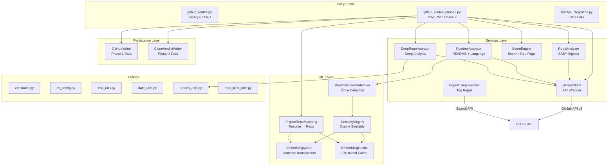

# GitHub Scraper — Complete Architecture Guide

> A two-phase GitHub profile ownership verification system that analyzes repositories to produce a **0–100 ownership score** with red flags, deep clone detection, and resume-to-repo matching.

---

## Table of Contents

1. [High-Level Architecture](#high-level-architecture)
2. [Directory Structure](#directory-structure)
3. [Data Flow](#data-flow)
4. [Package Breakdown](#package-breakdown)
   - [Routes (Entry Points)](#1-routes--entry-points)
   - [Services (Core Logic)](#2-services--core-logic)
   - [ML (Machine Learning)](#3-ml--machine-learning)
   - [Persistence (Data Storage)](#4-persistence--data-storage)
   - [Utils (Shared Utilities)](#5-utils--shared-utilities)
5. [Root-Level Files](#root-level-files)
6. [Configuration & Constants](#configuration--constants)
7. [Scoring System](#scoring-system)
8. [Phase 1 vs Phase 2](#phase-1-vs-phase-2)
9. [External Dependencies](#external-dependencies)

---

## High-Level Architecture



---

## Directory Structure

```
e:\github scraper\
│
├── github/                          # Main package (all production code)
│   ├── __init__.py                  # Package init
│   │
│   ├── routes/                      # API entry points / orchestrators
│   │   ├── __init__.py
│   │   ├── github_routes.py         # ⚠️ DEPRECATED — Legacy Phase 1 routes
│   │   └── github_routes_phase2.py  # ✅ Production — Phase 1 + Phase 2 routes
│   │
│   ├── services/                    # Core business logic
│   │   ├── __init__.py
│   │   ├── github_client.py         # GitHub API v3 wrapper
│   │   ├── repo_analyzer.py         # Repository signal extraction
│   │   ├── readme_analyzer.py       # README parsing & language matching
│   │   ├── score_engine.py          # Score computation & red flags
│   │   ├── deep_repo_analyzer.py    # Phase 2 deep analysis orchestrator
│   │   └── popular_repo_fetcher.py  # Fetches top GitHub repos for clone comparison
│   │
│   ├── ml/                          # Machine learning components (Phase 2)
│   │   ├── __init__.py
│   │   ├── config/
│   │   │   ├── __init__.py
│   │   │   └── ml_config.py         # All ML thresholds, feature flags, paths
│   │   ├── embeddings/
│   │   │   ├── __init__.py
│   │   │   ├── embedding_model.py   # sentence-transformers wrapper
│   │   │   └── embedding_cache.py   # File-based embedding cache
│   │   ├── inference/
│   │   │   ├── __init__.py
│   │   │   └── similarity_engine.py # Cosine similarity + verdict logic
│   │   └── pipelines/
│   │       ├── __init__.py
│   │       ├── project_repo_matching.py   # Resume project ↔ repo matching
│   │       └── readme_clone_detection.py  # README clone/template detection
│   │
│   ├── persistence/                 # Database writers
│   │   ├── __init__.py
│   │   ├── github_writer.py         # Phase 1 data persistence
│   │   └── clone_verdict_writer.py  # Phase 2 deep analysis persistence
│   │
│   └── utils/                       # Shared utilities
│       ├── __init__.py
│       ├── constants.py             # Phase 1 weights, thresholds, flags
│       ├── text_utils.py            # Text cleaning & keyword extraction
│       ├── date_utils.py            # Commit date analysis
│       ├── branch_utils.py          # Branch strategy analysis
│       └── repo_filter_utils.py     # Quality filtering for repos
│
├── fastapi_integration.py           # Complete FastAPI REST API server
├── example_usage.py                 # Usage examples & demos
├── test_phase2_deterministic.py     # Phase 2 unit tests (6 tests)
├── test_project_matching.py         # Project matching integration test
├── test_system.py                   # Full system integration tests
├── check_rate_limit.py              # Quick rate limit checker
├── verify_changes.py                # Post-change verification script
├── verify_simple.py                 # Simple import verification
├── debug_imports.py                 # Import debugging helper
├── requirements.txt                 # Phase 1 dependencies
└── requirements-phase2.txt          # Phase 2 ML dependencies
```

---

## Data Flow

### Phase 1: Basic Analysis

```
User Input (username/URL)
    │
    ▼
GitHubClient.get_user_repos()          → Fetch all repos via API
    │
    ▼
RepoAnalyzer.analyze_repos()           → For each repo:
    ├── Fetch commits (branch-aware)      • Commit count, spread, dump detection
    ├── Check fork/original status        • Template & parent detection
    ├── Check OSS contribution            • Allowlist matching
    ├── Check trivial name                • Pattern matching
    └── Get languages                     • API language breakdown
    │
    ▼
ReadmeAnalyzer.analyze_readmes()       → For each repo:
    ├── Fetch README content              • Base64 decode
    ├── Clean & extract keywords          • Regex-based NLP
    └── Check language mismatch           • README keywords vs repo languages
    │
    ▼
ScoreEngine.compute_score()            → Weighted scoring:
    ├── original_ratio (30 pts)
    ├── commit_depth (25 pts)
    ├── readme_presence (15 pts)
    ├── language_match (15 pts)
    ├── oss_bonus (10 pts)
    ├── Red flag identification (8 checks)
    └── Penalty calculation (capped at 25)
    │
    ▼
GitHubWriter.write_github_data()       → Persist to DB (if configured)
    │
    ▼
Return: { score, redFlags, components, stats }
```

### Phase 2: Deep Analysis (extends Phase 1)

```
Phase 1 Results + Resume Projects
    │
    ▼
ProjectRepoMatching.match_projects_to_repos()
    ├── Generate embeddings for resume projects
    ├── Generate embeddings for repositories
    ├── Cosine similarity matching
    └── Return matched project ↔ repo pairs
    │
    ▼
apply_quality_filters() + get_top_repos()
    ├── Filter: original only, has README, non-trivial, min 5 commits
    └── Sort by stars, limit to MAX_DEEP_ANALYSIS_REPOS
    │
    ▼
DeepRepoAnalyzer.deep_analyze_matched_repos()
    ├── For each matched repo:
    │   ├── Fetch branches & per-branch commits
    │   ├── Analyze commit spread & branch strategy
    │   ├── Fetch popular similar repos (GitHub Search API)
    │   └── ReadmeCloneDetection: compare README vs popular repos
    │       ├── Compute similarity scores
    │       ├── Verdict: COPIED / TEMPLATE / ORIGINAL
    │       └── Generate red flags & clone penalty
    │
    ▼
Final Score = Phase1 Score - sum(clone_penalties)
    │
    ▼
CloneVerdictWriter.write_deep_analysis()  → Persist Phase 2 data
```

---

## Package Breakdown

### 1. Routes — Entry Points

#### `github_routes_phase2.py` ✅ (Production)
**326 lines** | The main orchestrator for the entire analysis pipeline.

**Class: `GitHubAnalysisService`**

| Method | Purpose |
|--------|---------|
| `__init__(github_token, db_client)` | Initializes all Phase 1 & Phase 2 components. Gets token from `GITHUB_TOKEN` env var if not provided. Phase 2 components are optional — wrapped in try/except for graceful degradation. |
| `extract_username_from_url(github_url)` | Static method. Extracts username from URLs like `https://github.com/user` or returns raw username. Filters out known GitHub paths (`/explore`, `/trending`, etc.). |
| `analyze_github_profile(github_input, user_id, resume_projects)` | Main pipeline entry point. Runs Phase 1 always, Phase 2 conditionally (only if `resume_projects` provided and ML dependencies installed). Applies quality pre-filtering before deep analysis. |
| `get_rate_limit_status()` | Proxies to `GitHubClient.check_rate_limit()`. |
| `is_phase2_enabled()` | Returns whether Phase 2 ML dependencies are available. |

**Key design decisions:**
- Phase 2 imports are wrapped in `try/except ImportError` so the system works without ML dependencies
- Pre-filters repos through `apply_quality_filters()` and `get_top_repos()` before deep analysis
- Clone penalties subtract from the Phase 1 score, floor-clamped at 0

---

#### `github_routes.py` ⚠️ (Deprecated Legacy)
**316 lines** | Original Phase 1 route file.

Identical class name (`GitHubAnalysisService`) but lacks pre-filtering and has a known bug where `clone_penalty` is passed incorrectly. Kept only for backward compatibility with auxiliary scripts (`example_usage.py`, `fastapi_integration.py`).

---

### 2. Services — Core Logic

#### `github_client.py`
**243 lines** | Raw GitHub API v3 wrapper.

**Class: `GitHubClient`**

| Method | Purpose |
|--------|---------|
| `__init__(token)` | Sets up `requests.Session` with auth headers. Token is optional (unauthenticated = 60 req/hr, authenticated = 5,000 req/hr). |
| `get_user_repos(username)` | Fetches all repos with pagination (100/page). Only `type=owner` repos. |
| `get_repo_languages(owner, repo_name)` | Returns `{language: bytes}` mapping from GitHub Language API. |
| `get_repo_readme(owner, repo_name)` | Fetches and base64-decodes README content. Returns `None` if no README. |
| `get_repo_commits(owner, repo, username, max_commits, all_branches)` | Multi-branch commit fetching. When `all_branches=True`, fetches from all branches (up to `MAX_BRANCHES_TO_ANALYZE`), deduplicates by SHA, and sorts by date. |
| `get_repo_branches(owner, repo_name)` | Fetches branch list for a repo. |
| `_fetch_commits_single_branch(owner, repo, username, max_commits, sha)` | Internal helper — fetches commits for one branch. `sha` param specifies the branch. |
| `check_rate_limit()` | Returns current rate limit status. |

**Important notes:**
- All methods return empty collections (`[]`, `{}`, `None`) on API errors — no exceptions propagated
- There is a duplicate `get_repo_commits` method at lines 125-149 (dead code, shadowed by the newer version at line 163)
- Uses `requests.Session` for connection pooling

---

#### `repo_analyzer.py`
**199 lines** | Extracts "EASY" ownership signals from repositories.

**Class: `RepoAnalyzer`**

| Method | Purpose |
|--------|---------|
| `analyze_repos(username, repos)` | Main entry. Loops through every repo, aggregates stats. Returns `repositoryStats`, `commitStats`, `commitSpread`, `ossContributions`, `trivialRepos`, `reposDumpPattern`, and `enrichedRepositories`. |
| `_analyze_single_repo(username, repo)` | Per-repo analysis: commits, fork detection, template detection, parent/source detection, OSS contribution check, trivial name check, language retrieval. |
| `_is_oss_contribution(repo, commit_count)` | Checks if a forked repo is from a known OSS organization (from `OSS_ALLOWLIST`) with ≥ `MIN_OSS_COMMITS`. |

**Enriched repo fields added:** `is_fork`, `is_template`, `has_parent`, `parent_repo`, `is_original`, `is_oss_contribution`, `commit_count`, `commit_dates`, `has_dump_pattern`, `is_trivial`, `languages`, `stars`, `forks`, `created_at`, `updated_at`, `description`.

---

#### `readme_analyzer.py`
**165 lines** | Parses READMEs and checks language consistency.

**Class: `ReadmeAnalyzer`**

| Method | Purpose |
|--------|---------|
| `analyze_readmes(enriched_repos)` | Iterates repos, fetches README, extracts keywords, checks language mismatch. Returns `readmeStats`, `languageMatchStats`, and `enhancedRepositories` (repos enriched with README data). |
| `_analyze_single_readme(repo_data)` | For one repo: fetches README via API, cleans text, extracts language keywords, checks mismatch. Adds `has_readme`, `readme_length`, `readme_detected_languages`, `has_language_mismatch`. |
| `_check_language_mismatch(detected_languages, repo_languages)` | Compares languages found in README text vs top 3 repo languages from GitHub API. Mismatch = README mentions languages that aren't in the repo. |
| `get_dominant_languages(repo_languages, top_n)` | Helper to get top N languages by byte count. |

**Mismatch logic:** A global mismatch flag is only raised when `≥ MISMATCH_REPO_THRESHOLD` (2) repos have individual mismatches.

---

#### `score_engine.py`
**223 lines** | Computes the final 0–100 ownership score.

**Class: `ScoreEngine`**

| Method | Weight | Logic |
|--------|--------|-------|
| `_score_original_ratio(ratio)` | 30 pts | Linear: `ratio × 30` |
| `_score_commit_depth(commit_stats)` | 25 pts | Tiered: 50+ avg → 100%, 20+ → 92%, 10+ → 72%, 5+ → 40%, <5 → 20% |
| `_score_readme_presence(readme_stats)` | 15 pts | Linear: `presence_ratio × 15` |
| `_score_language_match(language_match_stats)` | 15 pts | Binary: mismatch → 30%, no mismatch → 100% |
| `_score_oss_contributions(oss_count)` | 10 pts | Tiered: 3+ → 100%, 1-2 → 50%, 0 → 0% |

**8 Red flag checks:**

| # | Flag | Condition |
|---|------|-----------|
| 1 | Mostly forked | `original_ratio < 0.4` |
| 2 | Low commit depth | `avg_per_repo < MIN_COMMITS_PER_REPO` (5) |
| 3 | Commit dump | Overall dump pattern OR ≥2 repos with dump |
| 4 | Missing README | `readme_presence_ratio < 0.5` |
| 5 | Tech stack mismatch | Global language mismatch flag |
| 6 | Trivial repos | `> 40%` of repos are trivial |
| 7 | Template repos | `> 50%` of repos are templates |
| 8 | Parent/source | Any repo has a parent/source repo (disguised fork) |

**Penalty:** 5 points per flag, capped at `RED_FLAG_PENALTY_MAX` (25).

**Formula:** `final_score = clamp(raw_score - penalty, 0, 100)`

---

#### `deep_repo_analyzer.py`
**210 lines** | Phase 2 — In-depth repository analysis.

**Class: `DeepRepoAnalyzer`**

| Method | Purpose |
|--------|---------|
| `__init__(github_client)` | Initializes with GitHub client, creates `ReadmeCloneDetection` and `PopularRepoFetcher` instances. |
| `analyze_repo_deep(owner, repo_name, username, readme)` | Deep-analyzes one repo: fetches branches & per-branch commits, analyzes commit spread, analyzes branch strategy (via `branch_utils.analyze_branch_strategy`), fetches similar popular repos, runs README clone detection. |
| `analyze_repos_deep(repos, username)` | Batch wrapper — calls `analyze_repo_deep` for each repo, collects results. |
| `deep_analyze_matched_repos(matched_repos, all_repo_data)` | Called by route files. Extracts repo info from matched projects, runs deep analysis, enriches results with `clone_penalty` and `deep_red_flags`. |

**Deep analysis result fields per repo:** `repo_name`, `owner`, `commit_stats` (total commits, branch count, is_dump_pattern, spread analysis), `branch_strategy`, `clone_detection` (similarity, verdict, matched repo), `red_flags`.

---

#### `popular_repo_fetcher.py`
**145 lines** | Fetches top GitHub repos for clone comparison.

**Class: `PopularRepoFetcher`**

| Method | Purpose |
|--------|---------|
| `__init__(github_token)` | Sets up session and in-memory cache with TTL. |
| `fetch_top_repos(language, min_stars)` | Generic search for top repos by language/stars using GitHub Search API. Caches results. |
| `fetch_similar_repos(repo_name, readme_keywords)` | Builds a search query from repo name + README keywords, fetches matching repos. Used by clone detection to find potential originals. |
| `_get_cache_key(*args)` | SHA256-based cache key generation. |

**Cache:** In-memory dict with TTL (from `ml_config.POPULAR_REPO_CACHE_TTL`). Cross-platform cache dir using `tempfile.gettempdir()`.

---

### 3. ML — Machine Learning

#### `ml_config.py`
**137 lines** | Central configuration for all ML settings.

| Category | Key Constants |
|----------|---------------|
| **Model** | `EMBEDDING_MODEL_NAME = "all-MiniLM-L6-v2"`, `EMBEDDING_DIMENSION = 384`, `MAX_TEXT_LENGTH = 512` |
| **Similarity thresholds** | `SIMILARITY_HIGH = 0.85` (COPIED), `SIMILARITY_MEDIUM = 0.65` (TEMPLATE), below = ORIGINAL |
| **Processing limits** | `MAX_DEEP_ANALYSIS_REPOS = 5`, `MAX_POPULAR_REPOS_TO_COMPARE = 10` |
| **Verdicts** | `VERDICT_COPIED`, `VERDICT_TEMPLATE`, `VERDICT_ORIGINAL` |
| **Red flags** | `RED_FLAG_COPIED`, `RED_FLAG_TEMPLATE` |
| **Caching** | `ENABLE_EMBEDDING_CACHE = True`, `EMBEDDING_CACHE_TTL = 86400` (24h), `EMBEDDING_CACHE_DIR` uses `tempfile.gettempdir()` |
| **Feature flags** | `ENABLE_PROJECT_MATCHING`, `DEEP_ANALYZE_MATCHED_REPOS_ONLY` |
| **Project matching** | `PROJECT_MATCH_HIGH = 0.75`, `PROJECT_MATCH_MEDIUM = 0.50` |

---

#### `embedding_model.py`
**114 lines** | Wrapper around `sentence-transformers`.

**Class: `EmbeddingModel`**

| Method | Purpose |
|--------|---------|
| `__init__()` | Sets model name and dimension. Model is **not** loaded yet (lazy loading). |
| `_load_model()` | Loads `SentenceTransformer` on first use. Forces CPU-only (`device="cpu"`). |
| `get_embedding(text)` | Returns normalized 384-dim numpy vector for one text. Truncates to `MAX_TEXT_LENGTH` chars. |
| `get_embeddings_batch(texts)` | Batch embedding generation (more efficient). |
| `compute_similarity(text1, text2)` | Convenience: embed both texts, return cosine similarity. |

**Key design:** Lazy loading avoids model load overhead if never called. CPU-only ensures portability.

---

#### `embedding_cache.py`
**144 lines** | File-based embedding cache.

**Class: `EmbeddingCache`**

| Method | Purpose |
|--------|---------|
| `__init__(cache_dir)` | Creates cache directory. Defaults to `tempfile.gettempdir()/github_embeddings_cache`. |
| `get(text)` | Returns cached numpy array or `None`. Uses SHA256 hash of text as filename. Checks TTL expiration. |
| `set(text, embedding)` | Saves embedding as `.npy` file + metadata `.json` (timestamp, text length). Silent failure on write errors. |
| `_get_cache_key(text)` | SHA256 hash of text → hex string. |

**Cache format:** Each entry = two files: `{sha256_hash}.npy` (embedding) + `{sha256_hash}.json` (metadata).

---

#### `similarity_engine.py`
**136 lines** | Computes and interprets similarity scores.

**Class: `SimilarityEngine`**

| Method | Purpose |
|--------|---------|
| `__init__()` | Creates `EmbeddingModel` and `EmbeddingCache`. |
| `compute_similarity(text1, text2)` | Returns float 0.0–1.0 cosine similarity. Uses cache for both texts. |
| `find_max_similarity(candidate, references)` | Compares candidate against list of references, returns highest similarity + matched reference. |
| `get_verdict(similarity)` | Maps score → `COPIED` (≥0.85) / `TEMPLATE` (≥0.65) / `ORIGINAL` (<0.65). |
| `get_penalty(similarity)` | Maps score → penalty points: COPIED = 15, TEMPLATE = 5, ORIGINAL = 0. |
| `get_red_flags(similarity)` | Generates red flag messages based on verdict. |

---

#### `project_repo_matching.py`
**193 lines** | Matches resume projects to GitHub repositories.

**Class: `ProjectRepoMatching`**

| Method | Purpose |
|--------|---------|
| `__init__()` | Initializes `EmbeddingModel` + `EmbeddingCache` (if enabled via `USE_EMBEDDING_CACHE`). |
| `match_projects_to_repos(projects, repositories)` | Main entry. For each resume project, finds best matching repository by embedding similarity. Returns list of `{project, repository, similarity, match_strength}`. |
| `_create_project_text(project)` | Combines project name + description + technologies into embeddable text. |
| `_create_repo_text(repo)` | Combines repo name + description + languages into embeddable text. |
| `_determine_match_strength(similarity)` | Maps similarity → `HIGH` (≥0.75) / `MEDIUM` (≥0.50) / `LOW` (<0.50). |

**Thresholds:** Imported from `ml_config.py` (`PROJECT_MATCH_HIGH`, `PROJECT_MATCH_MEDIUM`).

---

#### `readme_clone_detection.py`
**152 lines** | Detects if a README is copied from a popular repository.

**Class: `ReadmeCloneDetection`**

| Method | Purpose |
|--------|---------|
| `__init__()` | Creates `SimilarityEngine` instance. |
| `detect(candidate_readme, popular_readmes)` | Compares one README against a list of popular READMEs. Returns `{similarity, verdict, matched_repo, red_flags}`. |
| `batch_detect(repos_with_readmes, popular_readmes)` | Batch version of `detect` for multiple repos. |

**Verdict logic:**
- `similarity ≥ 0.85` → **COPIED** — "High similarity to popular repo README"
- `similarity ≥ 0.65` → **TEMPLATE** — "README appears to follow a common template"
- `similarity < 0.65` → **ORIGINAL** — No red flags

---

### 4. Persistence — Data Storage

#### `github_writer.py`
**159 lines** | Persists Phase 1 analysis results.

**Class: `GitHubWriter`**

| Method | Purpose |
|--------|---------|
| `write_github_data(user_id, username, score_result, repo_analysis, readme_analysis)` | Formats all analysis data into a structured `githubData` document. If `db_client` provided, persists to database. Always returns the formatted data. |
| `_format_repositories(enhanced_repos)` | Strips raw repos down to essential fields for storage (removes commit_dates, etc.). |
| `_persist_to_database(user_id, github_data)` | Database write — currently a stub with MongoDB example in comments. |
| `get_github_data(user_id)` | Retrieves stored data — currently returns `None` (stub). |

---

#### `clone_verdict_writer.py`
**134 lines** | Persists Phase 2 deep analysis results.

**Class: `CloneVerdictWriter`**

| Method | Purpose |
|--------|---------|
| `write_deep_analysis(user_id, username, deep_results, clone_penalty)` | Formats deep analysis into `deepAnalysis` document with clone verdicts, similarities, matched repos, and red flags. |
| `_format_deep_repos(deep_results)` | Extracts minimal clone detection fields per repo (similarity, verdict, matched repo, commit stats, red flags). |
| `_persist_to_database(user_id, deep_analysis_data)` | Database write — stub (same as `GitHubWriter`). |
| `get_deep_analysis(user_id)` | Retrieves stored deep analysis — stub. |

---

### 5. Utils — Shared Utilities

#### `constants.py`
**145 lines** | All Phase 1 configuration constants.

| Section | Key Values |
|---------|------------|
| **Scoring weights** | `original_repo_ratio: 30`, `commit_depth: 25`, `readme_presence: 15`, `readme_language_match: 15`, `oss_contribution_bonus: 10` (total = 95 max from components + penalty) |
| **Thresholds** | `MIN_COMMITS_PER_REPO = 5`, `COMMIT_DUMP_RATIO = 0.70`, `MIN_README_LENGTH = 100`, `MIN_OSS_COMMITS = 10`, `MISMATCH_REPO_THRESHOLD = 2` |
| **OSS allowlist** | 36 organizations (apache, kubernetes, tensorflow, etc.) |
| **Trivial patterns** | 12 patterns (todo, clone, calculator, test, demo, etc.) |
| **Language keywords** | 19 languages with framework mappings |
| **Red flag messages** | 8 flag message templates |
| **API config** | `MAX_COMMITS_PER_REPO = 100`, `MAX_BRANCHES_TO_ANALYZE = 10`, `ANALYZE_ALL_BRANCHES = True`, `REQUEST_TIMEOUT = 30` |

---

#### `text_utils.py`
**101 lines** | Text processing utilities.

| Function | Purpose |
|----------|---------|
| `extract_keywords_from_text(text)` | Regex-based language detection from text. Uses word boundaries to avoid false positives. Returns `Set[str]` of language names. |
| `clean_text(text)` | Normalizes whitespace, removes markdown code blocks. |
| `is_trivial_repo_name(repo_name, trivial_patterns)` | Checks if repo name contains any trivial pattern (case-insensitive substring match). |
| `calculate_text_similarity(text1, text2)` | Simple Jaccard word-overlap similarity (used as a fallback, not the primary similarity method). |

---

#### `date_utils.py`
**133 lines** | Commit temporal analysis.

| Function | Purpose |
|----------|---------|
| `parse_github_date(date_string)` | Parses ISO 8601 `"2024-01-15T10:30:00Z"` → `datetime`. |
| `analyze_commit_spread(commit_dates)` | Detects "commit dump" pattern. Groups commits by day, checks if ≥70% of commits fall in the 2 busiest days. Returns `total_commits`, `unique_days`, `is_dump_pattern`, `max_day_ratio`, `date_range_days`. |
| `get_most_recent_commit_date(commit_dates)` | Returns the latest commit date as ISO string. |
| `calculate_commit_consistency(commit_dates)` | Measures how evenly commits are spread. `unique_days / total_commits` ratio, higher = more consistent. |

---

#### `branch_utils.py`
**112 lines** | Branch strategy analysis.

| Function | Purpose |
|----------|---------|
| `aggregate_branch_commits(branch_commits)` | Deduplicates commits across branches, tracks which branches each commit appears in. Returns total unique commits, per-branch counts. |
| `get_primary_development_branch(branch_commits)` | Identifies the branch with the most commits. |
| `analyze_branch_strategy(branch_commits)` | Classifies branching strategy: `gitflow` (develop + feature/release branches), `feature_branch`, `single_branch`, `simple_multi_branch`, `complex_multi_branch`. |

---

#### `repo_filter_utils.py`
**152 lines** | Quality filtering for repositories before deep analysis.

| Function | Purpose |
|----------|---------|
| `filter_by_commit_count(repos, min_commits)` | Keeps repos with ≥ N commits |
| `filter_original_only(repos)` | Removes forks |
| `filter_with_readme(repos)` | Keeps repos that have a README |
| `filter_non_trivial(repos)` | Removes trivial repos |
| `filter_by_stars(repos, min_stars)` | Keeps repos with ≥ N stars |
| `filter_matched_repos(repos, matched_repo_names)` | Keeps only repos matching a name list |
| `get_top_repos(repos, limit, sort_by)` | Returns top N repos sorted by stars/commits/forks |
| `apply_quality_filters(repos)` | **Composite filter** — applies original + has_readme + non-trivial + min 5 commits |

---

## Root-Level Files

| File | Lines | Purpose |
|------|------:|---------|
| `fastapi_integration.py` | 357 | Complete REST API server with Pydantic models, CORS, error handlers, batch analysis endpoint, health check. Run with `uvicorn` on port 8000. |
| `example_usage.py` | 156 | Usage demos: basic analysis, persistence, rate limit check, JSON export, batch analysis. |
| `test_phase2_deterministic.py` | ~300 | 6 unit tests for Phase 2 components (embedding model, cache, similarity engine, project matching, clone detection, config). All tests pass. |
| `test_project_matching.py` | ~120 | Integration test for the project matching pipeline. |
| `test_system.py` | ~200 | Full system integration tests. |
| `check_rate_limit.py` | ~30 | Quick script to check GitHub API rate limit status. |
| `verify_changes.py` | ~30 | Post-change verification script. |
| `verify_simple.py` | ~15 | Simple import verification. |
| `debug_imports.py` | ~10 | Debug helper for import issues. |
| `requirements.txt` | — | Phase 1 deps: `requests` |
| `requirements-phase2.txt` | — | Phase 2 deps: `sentence-transformers`, `numpy`, `torch`, `python-dateutil` |
| `.env` | — | Environment variables (`GITHUB_TOKEN`) |

---

## Configuration & Constants

The system has two configuration files:

| File | Scope | Used By |
|------|-------|---------|
| `utils/constants.py` | Phase 1 — scoring weights, thresholds, allowlists, API config | `repo_analyzer.py`, `readme_analyzer.py`, `score_engine.py`, `github_client.py`, `text_utils.py` |
| `ml/config/ml_config.py` | Phase 2 — ML model config, similarity thresholds, processing limits, feature flags | All ML files, `deep_repo_analyzer.py`, route files |

---

## Scoring System

```
                ┌─────────────────────────────────────────┐
                │           RAW SCORE (max ~95)            │
                │                                         │
                │  Original Ratio ────── 30 pts (linear)  │
                │  Commit Depth ──────── 25 pts (tiered)  │
                │  README Presence ───── 15 pts (linear)  │
                │  Language Match ────── 15 pts (binary)  │
                │  OSS Bonus ─────────── 10 pts (tiered)  │
                └───────────────┬─────────────────────────┘
                                │
                    ┌───────────▼───────────┐
                    │   RED FLAG PENALTIES   │
                    │   5 pts × num_flags   │
                    │   (max 25 pts)        │
                    └───────────┬───────────┘
                                │
                    ┌───────────▼───────────┐
                    │   CLONE PENALTIES      │
                    │   (Phase 2 only)       │
                    │   COPIED = 15 pts     │
                    │   TEMPLATE = 5 pts    │
                    └───────────┬───────────┘
                                │
                    ┌───────────▼───────────┐
                    │    FINAL SCORE         │
                    │    clamp(0, 100)       │
                    └───────────────────────┘
```

---

## Phase 1 vs Phase 2

| Aspect | Phase 1 | Phase 2 |
|--------|---------|---------|
| **Dependencies** | `requests` only | + `sentence-transformers`, `numpy`, `torch` |
| **Signals** | Fork ratio, commits, README presence, language match, OSS, trivial, template, parent | + README clone detection, resume-project matching, branch strategy |
| **Analysis depth** | Per-repo basic signals | Deep per-repo: cross-reference with popular repos |
| **ML** | None | Embedding similarity (all-MiniLM-L6-v2, 384-dim) |
| **Config file** | `constants.py` | + `ml_config.py` |
| **Route file** | `github_routes.py` (deprecated) | `github_routes_phase2.py` |
| **Persistence** | `GitHubWriter` | + `CloneVerdictWriter` |
| **Availability** | Always | Only if ML deps installed |

---

## External Dependencies

### APIs
| API | Purpose | Auth |
|-----|---------|------|
| GitHub API v3 (`api.github.com`) | Repos, commits, branches, READMEs, languages, rate limit | Optional token (`.env`) |
| GitHub Search API | Popular repo lookup for clone comparison | Same token |

### Python Packages
| Package | Version | Phase | Purpose |
|---------|---------|-------|---------|
| `requests` | Any | 1 | HTTP client for GitHub API |
| `sentence-transformers` | ≥2.0 | 2 | Embedding model (`all-MiniLM-L6-v2`) |
| `numpy` | ≥1.20 | 2 | Embedding storage & cosine similarity |
| `torch` | ≥1.9 | 2 | Backend for sentence-transformers |
| `python-dateutil` | ≥2.8 | 2 | Date parsing utilities |
